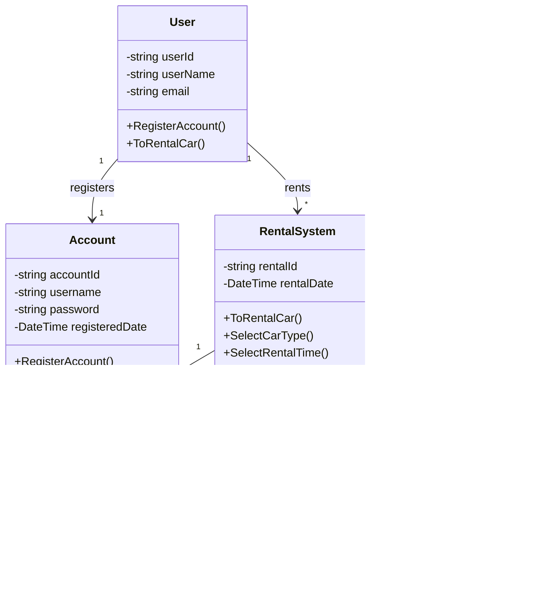

# 車輛租用系統 Class Diagram

```mermaid
classDiagram
    class User {
        -string userId
        -string userName
        -string email
        +RegisterAccount()
        +ToRentalCar()
    }
    
    class Account {
        -string accountId
        -string username
        -string password
        -DateTime registeredDate
        +RegisterAccount()
    }
    
    class RentalSystem {
        -string rentalId
        -DateTime rentalDate
        +ToRentalCar()
        +SelectCarType()
        +SelectRentalTime()
        +CalculateFee()
    }
    
    class CarType {
        -string carTypeId
        -string typeName
        -decimal dailyRate
        +SelectCarType()
    }
    
    class RentalTime {
        -DateTime startTime
        -DateTime endTime
        -int duration
        +SelectRentalTime()
    }
    
    class FeeCalculator {
        -decimal totalFee
        -decimal discount
        +CalculateFee()
    }
    
    User "1" --> "1" Account : registers
    User "1" --> "*" RentalSystem : rents
    RentalSystem "1" --> "1" CarType : selects
    RentalSystem "1" --> "1" RentalTime : defines
    RentalSystem "1" --> "1" FeeCalculator : calculates with
```
