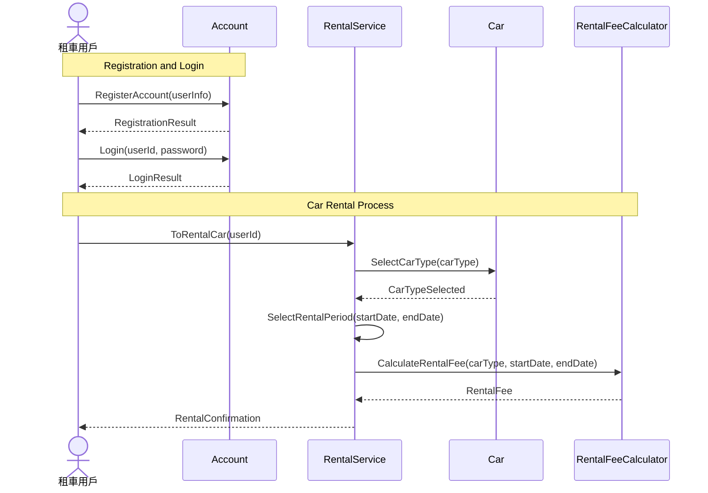
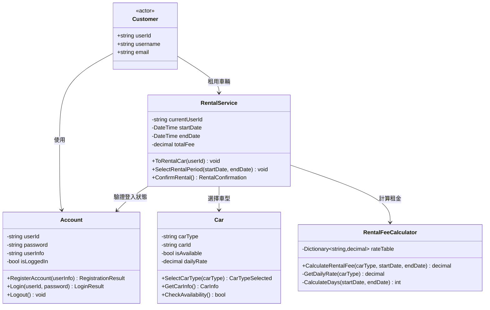

# RentalCar 線上預先車輛租用系統

## 系統說明
這是一個提供租車用戶可在線上預先租用車輛的系統。系統功能為，租車用戶可以在線上預約租車，而在租用車輛之前，租車用戶必須先註冊自已的帳戶資料後，並進行登入後才可預先租用車輛。在租用車輛時，可以選擇車型、租用時間區間、並計算租金。

## 系統架構未定：可能使用六角架構

與訂先以 TDD 開發方法完成 Domain Model 的設計與實作，並以 DDD 的戰略設計來劃分 Bounded Context，並以 CQRS 的架構來設計 Application Services 層、以及 Infrastructure 層，最後以 ASP.NET Core MVC 來設計 UI 層。

## Sequence Diagram 參考

## Class Diagram

## 選擇車型
車型有轎車 Car、休旅車 SUV、貨車 Truck、跑車 SportsCar、電動車 ElectricCar 等等可供選擇

## 租金費用
Car 1000 元/天、SUV 1500 元/天、Truck 2000 元/天、SportsCar 3000 元/天、ElectricCar 2800 元/天

## UI 車輛租用系統 UI 設計
這個車輛租用系統 UI 使用 ASP.NET Core 9 的 MVC 來設計，使用 Bootstrap 5.1 來設計 UI 的 RWD 介面，同時建立 Controller，並在 Controller 中呼叫 Application Services 提供的 CQRS 的 Command 的相關方法來完成帳號 Account or Customer 以及租用車輛畫面的 View 檢視表 cshtml，並能夠以這些 View 完成註冊 與 車輛租用等動作。

包含註冊帳號、登入、選擇車型、選擇租用時間區間、計算租金、確認租用等功能，並以 HTML/CSS/JavaScript 語法來實作這個 UI。