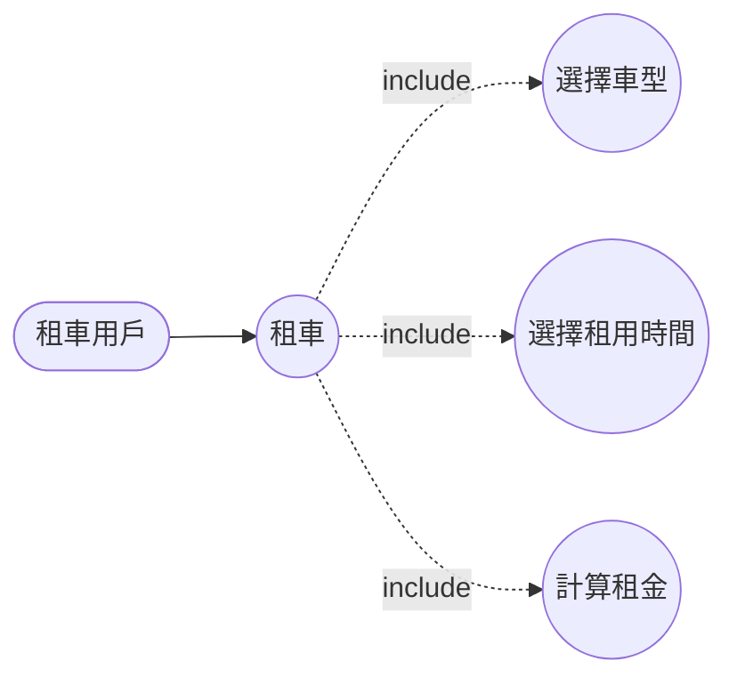

# 車輛租用系統 Use Case Diagram

```mermaid
flowchart LR
    User([租車用戶])
    
    RentCar((租車))
    SelectCarType((選擇車型))
    SelectRentalTime((選擇租用時間))
    CalculateFee((計算租金))
    
    User --> RentCar
    
    RentCar -.->|include| SelectCarType
    RentCar -.->|include| SelectRentalTime
    RentCar -.->|include| CalculateFee
```